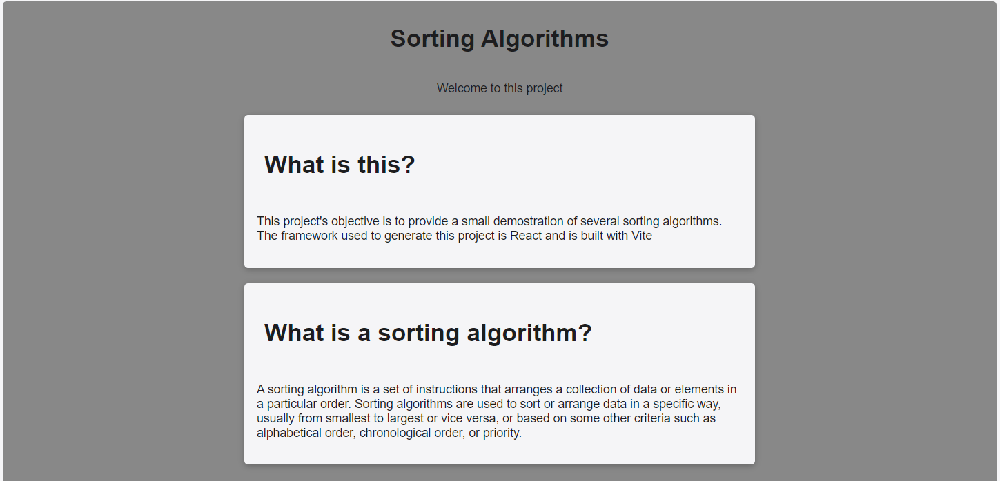
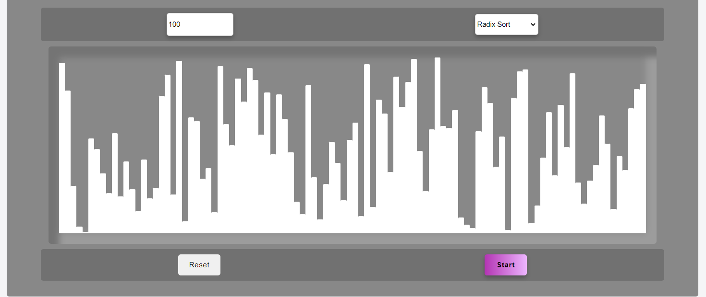
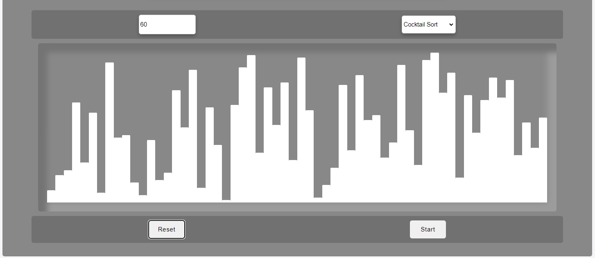
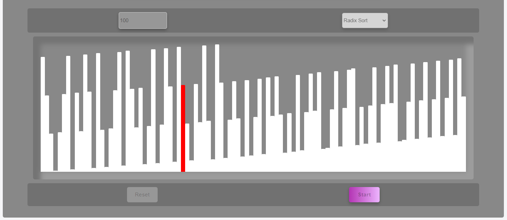

# Sorting Algorithms Visualizer

This is a simple web app that visualizes sorting algorithms. Is written with React and Typescript.

## How to run

1. Clone the repository
2. Run `npm install`
3. Run `npm run dev`
4. Open the browser at the indicated address

## Purpose

This project was created to learn more about React and Typescript. It is not intended to be used in production. It is not optimized for performance and it is not tested.

### Objectives

- [x] Create a simple web app
- [x] Use React
- [x] Use Typescript
- [x] Use React Hooks
- [x] Visualize sorting algorithms

## Algorithms

- [x] Bubble Sort
- [x] Quick Sort
- [x] Cocktail Sort
- [x] Radix Sort

## Results

This project was component based, so it was easy to add more static content as well as more algorithms in the app.

The algorithms were presented inside a neumorphic pannel with four controllers, from top right to bottom left: the ammount of elements to order, the selected algorithm, the reset button and the start button.

Finally the presentation of the algorithms happens in realtime as the app is sorting the elements.

